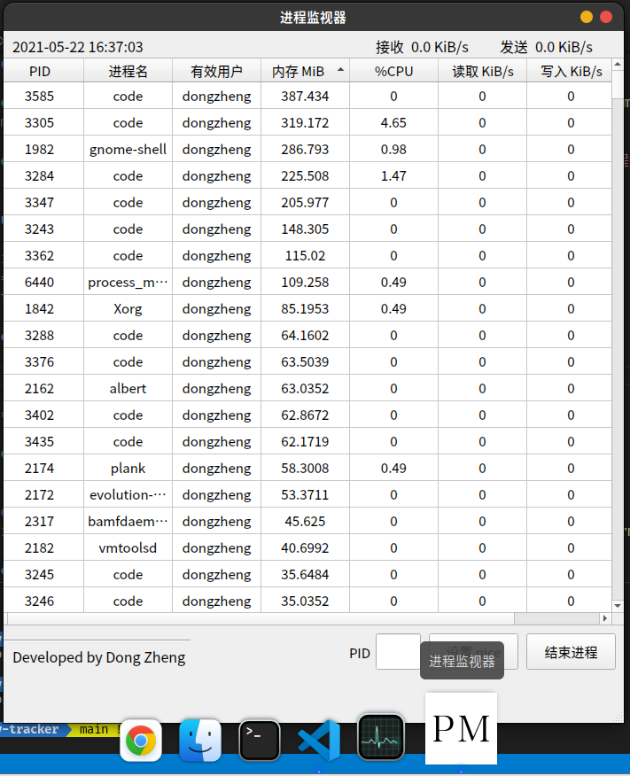
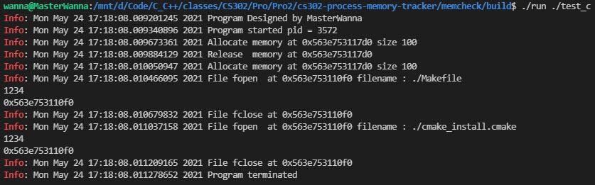
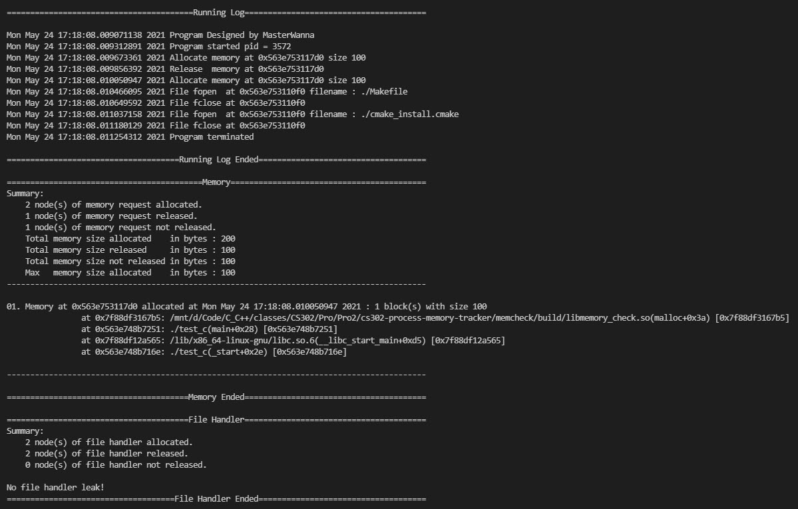

# CS302 Project 2 Final Report

## Result Analysis

### Task 1

Our goal of task 1 is to implement a tool with UI in `Python` to monitor the memory usage of processes in `Linux`.

And we decided to develop a more powerful software called **Process Monitor**. It is like a `Linux` version of `Windows Task Manager`.

Now it is finished and released at GitHub: https://github.com/XDZhelheim/cs302-process-memory-tracker/releases/. What's more, we have successfully installed it into `Ubuntu 20.04`. See the screenshot below:




**What we achieved (TODO list in design doc)**:

> Must implement (this project required):
>
> * [x] Learn about the files in `/proc/<pid>` folder
> * [x] Implement a command line `Python` program to extract information from `/proc`
> * [x] Show memory usage (RSS: resident set size) and update in real-time
> * [x] Sort data by memory usage (implemented in GUI)
>
> Further (not must-required but we will implement for the software):
>
> * [x] Learn basic usage of `PyQt` and `Qt Designer`
> * [x] Design the GUI of process monitor using `Qt Designer`
> * [x] Migrate existing CLI version to GUI, and show same info
> * [x] Multithreading: A new thread to fetch and update data, then update display
> * [x] Feature: sorting (ascending and descending) via clicking on the column title
> * [x] Show CPU usage of each process
> * [x] Show IO usage of each process
> * [x] Show network usage of system
> * [x] Identify system process and user process for protection
> * [x] Show the owner of each process
> * [x] Button: terminate selected process (cannot kill important system processes)
> * [x] Button & dialog: set `nice` value of selected process
> * [x] Deploy executable files & make a release of the software
>
> If have time:
>
> * [ ] Show these information of each process' child threads
> * [ ] Feature: search specific process
> * [x] Beautify GUI
> * [ ] Integrate Task2 & Task3 (make a GUI of task2 and task3)

Therefore, we have completed all we wanted to do in our design document, making **Process Monitor** a useful and robust software.

But in the "If have time" section, there are still some functions not done. It is easy to collect information about child threads, but it is hard to design a concise GUI to show this. If we put threads info into it, the GUI will be clumsy. In addition, the info of threads is less useful, and also, `Windows Task Manager` does not have it either. For the search function, we do not have enough time to do this.

### Task 2 & 3

Our goal in Task 2 & 3 is to give realtime memory and file handler operations and, after the program finishes, we need to determin whether there is memory and file handler not released in the program and gives out the stack trace of suspicious code.

Therefore, in the result, we finished it by producing a `shared object` in `linux` called `libmemory_check.so`, we can use this by command `LD_PRELOAD=<path to build dir>/libmemory_check.so <command>`. And it generates details we need.

A sample as follows:

```C
#include <stdlib.h>
#include <stdio.h>
#include <unistd.h>

int main(void)
{
    free(malloc(100));
    malloc(100);
    FILE *f = fopen("./Makefile", "rb");
    printf("1234\n");
    printf("%p\n", f);
    fflush(stdout);
    f = freopen("./cmake_install.cmake", "rb", f);
    printf("1234\n");
    printf("%p\n", f);
    fflush(stdout);
    fclose(f);
    return 0;
}
```

We can see obviously that 1 memory block not released in both code and result:

Program running:



Program finished:



**What we achieved (TODO list in design doc)**:

> Base requirements:
> 
> * [x] Implement the library in step 2.
> * [x] Generate a script supporting running with the library.
> * [x] Show memory operation and memory leak through `CLI`.
> 
> Improvements:
> 
> * [x] Show stack trace of memory operations which causes memory leak.
> * [x] Generate a `CLI` with more detail information like `pid`.
> * [x] Generate a `CLI` permitting normal running operation like `I/O`.
> * [x] Gather information log at the end of output.
> * [ ] Implement `GUI` for this task, using tools like `Qt`.

Therefore, we have completed most we wanted to do in our design document, making **Memory Check** a easy using command line apllication.

But in the "Improvements" section, about the GUI part, we have already made a very beautiful stack trace log in CLI, so there is no need to migrate it to GUI, showing the same information.

## Implementation

### Task 1

#### Environment

* `Ubuntu 20.04.2 LTS x86_64` with `Linux 5.8.0-50-generic`
* `Python 3.8.5`
* `PyQt5` and `PyQt5 Tools`
* `Qt Designer`

#### Full Codes GitHub Link

https://github.com/XDZhelheim/cs302-process-memory-tracker/blob/main/process_monitor/process_monitor.py

#### How to get mem usage

`Linux` provided a pseudo file directory `/proc` to us.

Under `/proc/[pid]/statm`, we can find how many pages the process used.

```
/proc/[pid]/statm
    Provides information about memory usage, measured in pages.
    The columns are:

        size       (1) total program size
                    (same as VmSize in /proc/[pid]/status)
        resident   (2) resident set size
                    (same as VmRSS in /proc/[pid]/status)
        share      (3) shared pages (i.e., backed by a file)
        text       (4) text (code)
        lib        (5) library (unused in Linux 2.6)
        data       (6) data + stack
        dt         (7) dirty pages (unused in Linux 2.6)
```

1. Get page size

   `PAGE_SIZE=int(os.sysconf("SC_PAGE_SIZE")/1024) # 4096 bytes / 1024 = 4 KiB`

2. Get pages used

   ```python
   with open(statm_path, "r") as statm:
   	pages=int(statm.readline().split()[1]) # page numbers of RSS
   ```

3. Calculate RSS (resident set size)

   `RSS = pages * PAGE_SIZE`

#### How to get process name

Read `/proc/[pid]/status`

```python
with open(status_path, "r") as status:
    lines=status.readlines()
    name=lines[0].split()[1]
```

#### How to get effective user

UID policy in `Linux`:

```
UID/GID	                Purpose	                Defined By	    Listed in
    0	                    root user	            Linux	        /etc/passwd + nss-systemd
    1…4	                    System users	        Distributions	/etc/passwd
    5	                    tty group	            systemd	        /etc/passwd
    6…999	                System users	        Distributions	/etc/passwd
    1000…60000	            Regular users	        Distributions	/etc/passwd + LDAP/NIS/…
    60001…60513	            Human Users (homed)	    systemd	        nss-systemd
    60514…61183	            Unused	 	 
    61184…65519	            Dynamic service users	systemd	        nss-systemd
    65520…65533	            Unused	 	 
    65534	                nobody user	            Linux	        /etc/passwd + nss-systemd
    65535	                16bit (uid_t) -1	    Linux	 
    65536…524287	        Unused	 	 
    524288…1879048191	    Container UID ranges	systemd	        nss-systemd
    1879048192…2147483647	Unused	 	 
    2147483648…4294967294	HIC SVNT LEONES	 	 
    4294967295	            32bit (uid_t) -1	    Linux
```

1. Set up a uid-user name dictionary

   ```python
   def set_uid_user_dict():
       global uid_user_dict
   
       passwd_path="/etc/passwd"
       
       with open(passwd_path, "r") as passwd:
           lines=passwd.readlines()
   
       for line in lines:
           line=line.split(":")
           uid=int(line[2])
           user=line[0]
   
           uid_user_dict[uid]=user
   ```

2. Read euid (effective user id) in `/proc/[pid]/status`

   ```python
   try:
       with open(status_path, "r") as status:
           euid=int(lines[8].split()[1])
           user=uid_user_dict[euid]
   except KeyError:
           if euid>=60001 and euid<=60513:
               user="Human Users (homed)"
           elif euid>=61184 and euid<=65519:
               user="Dynamic Service User"
   ```

#### How to get CPU usage

1. Read `/proc/stat` (the first row, 10 columns in total)

    - `user ` 从系统启动开始累计到当前时刻，处于用户态的运行时间，不包含 nice值为负进程
    - `nice` 从系统启动开始累计到当前时刻，nice值为负的进程所占用的CPU时间
    - `system` 从系统启动开始累计到当前时刻，处于核心态的运行时间
    - `idle` 从系统启动开始累计到当前时刻，除IO等待时间以外的其它等待时间
    - `iowait` 从系统启动开始累积到当前时刻，IO 等待时间
    - `irq` 从系统启动开始累积到当前时刻，硬中断时间
    - `softirq` 从系统启动开始累积到当前时刻，软中断时间
    - `stealstolen` Which is the time spent in other operating systems when running in a virtualized environment
    - `guest` Which is the time spent running a virtual CPU for guest operating systems under the control of the Linux kernel
    - Time spent running a niced guest (virtual CPU for guest operating systems under the control of the Linux kernel)

    `Total CPU time = user + nice + system + idle + iowait + irq + softirq + stealstolen + guest`

2. Read `/proc/[pid]/stat`

    - column 14: `utime` 该任务在用户态运行的时间，单位为 jiffies
    - column 15: `stime` 该任务在核心态运行的时间，单位为 jiffies
    - column 16: `cutime` 累计的该任务的所有的 waited-for 进程曾经在用户态运行的时间，单位为 jiffies
    - column 17: `cstime` 累计的该任务的所有的 waited-for 进程曾经在核心态运行的时间，单位为 jiffies

    `Process CPU time = utime + stime + cutime + cstime`
    
3. 采样两个足够短的时间间隔的 `(total_cpu_time_1, total_cpu_time_2) and (process_cpu_time_1, process_cpu_time_2)`

    `cpu_usage = (process_cpu_time_2 - process_cpu_time_1) / (total_cpu_time_2 - total_cpu_time_1) * 100%`

Code implementation:

```python
def get_total_cpu_time() -> int:
    cpu_stat_path=os.path.join(PROC_PATH, "stat")

    with open(cpu_stat_path, "r") as cpu_stat:
        cpu_time_components=cpu_stat.readline().split()[1:-1]
    cpu_time_components=list(map(int, cpu_time_components))
    total_cpu_time=sum(cpu_time_components)

    return total_cpu_time

def get_process_cpu_time(pid: int) -> int:
    process_stat_path=os.path.join(PROC_PATH, str(pid), "stat")

    try:
        with open(process_stat_path, "r") as process_stat:
            process_time_components=process_stat.readline().split()[13:17]
        process_time_components=list(map(int, process_time_components))
        process_cpu_time=sum(process_time_components)
    except FileNotFoundError:
        return 0

    return process_cpu_time

def get_process_cpu_usage_dict() -> dict:
    pid_cpu_usage_dict={}

    total_cpu_time_1=get_total_cpu_time()

    for pid in os.listdir(PROC_PATH):
        if not pid.isdigit():
            continue

        pid=int(pid)

        pid_cpu_usage_dict[pid]=get_process_cpu_time(pid)

    time.sleep(CPU_USAGE_SAMPLING_INTERVAL)

    total_cpu_time_2=get_total_cpu_time()

    for pid in os.listdir(PROC_PATH):
        if not pid.isdigit():
            continue

        pid=int(pid)

        try:
            pid_cpu_usage_dict[pid]=(get_process_cpu_time(pid) - pid_cpu_usage_dict[pid]) / (total_cpu_time_2 - total_cpu_time_1) * 100
        except KeyError:
            pass

    return pid_cpu_usage_dict
```

#### How to get network usage

`Linux` only provides network status of the whole system.

1. Read `/proc/net/dev` to get information about bytes send and received

   ```
   - /proc/net/dev
   
           The dev pseudo-file contains network device status
           information.  This gives the number of received and sent
           packets, the number of errors and collisions and other
           basic statistics.
   
       Inter-|   Receive                                                |  Transmit
        face |bytes    packets errs drop fifo frame compressed multicast|bytes    packets errs drop fifo colls carrier compressed
          lo: 2776770   11307    0    0    0     0          0         0  2776770   11307    0    0    0     0       0          0
        eth0: 1215645    2751    0    0    0     0          0         0  1782404    4324    0    0    0   427       0          0
        ppp0: 1622270    5552    1    0    0     0          0         0   354130    5669    0    0    0     0       0          0
        tap0:    7714      81    0    0    0     0          0         0     7714      81    0    0    0     0       0          0
   ```

   ```python
   def network_usage_helper() -> tuple:
       net_dev_path=os.path.join(PROC_PATH, "net", "dev")
       
       with open(net_dev_path, "r") as net_dev:
           net_info=net_dev.readlines()[2:]
   
       recv=0; trans=0
       for line in net_info:
           lst=line.split()
           recv+=int(lst[1])
           trans+=int(lst[9])
   
       return (recv, trans)
   ```

2. Sleep 1 second, and read again

3. Calculate `KiB/s`

    ```python
    def get_network_usage() -> tuple:
        recv_1, trans_1=network_usage_helper()
    
        time.sleep(1)
    
        recv_2, trans_2=network_usage_helper()
    
        recv_KBps=(recv_2-recv_1)/1024
        trans_KBps=(trans_2-trans_1)/1024
    
        return (recv_KBps, trans_KBps)
    ```

#### How to get I/O usage

1. Read `/proc/[pid]/io` for total I/O usage in bytes of a process

   ```python
   def get_process_io_usage(pid: int) -> tuple:
       process_io_path=os.path.join(PROC_PATH, str(pid), "io")
   
       try:
           with open(process_io_path, "r") as process_io:
               io_info=process_io.readlines()[4:6]
       except (PermissionError, FileNotFoundError):
           return (-1024, -1024)
   
       read_bytes=int(io_info[0].split()[1])
       write_bytes=int(io_info[1].split()[1])
   
       return (read_bytes, write_bytes)
   ```

2. Sleep 1 second, read again

3. Calculate `KiB/s`

   ```python
   def get_process_io_usage_dict() -> dict:
       pid_io_usage_dict={}
   
       for pid in os.listdir(PROC_PATH):
           if not pid.isdigit():
               continue
   
           pid=int(pid)
   
           pid_io_usage_dict[pid]=get_process_io_usage(pid)
   
       time.sleep(1)
   
       for pid in os.listdir(PROC_PATH):
           if not pid.isdigit():
               continue
   
           pid=int(pid)
   
           try:
               if (pid_io_usage_dict[pid][0]==-1024):
                   continue
   
               read_write=get_process_io_usage(pid)
           
               pid_io_usage_dict[pid]=(read_write[0]-pid_io_usage_dict[pid][0], read_write[1]-pid_io_usage_dict[pid][1])
           except KeyError:
               pass
       
       return pid_io_usage_dict
   ```

#### How to terminate a process

1. Make an input form and a button in GUI

2. Create a function to invoke `kill -15 [pid]` for selected process or input `pid`

   Note that we can only terminate regular users' processes, so need to check `euid`

   ```python
   def kill_pid(self):
       pid=self.pid_input.text()
   
       if not pid.isdigit():
           selected_pid=self.table.selectedItems()[0].text()
           if not selected_pid:
               return
           pid=int(selected_pid)
           else:
               pid=int(pid)
   
               name, euid, user=get_process_name_euid_user(pid)
               if euid==65534:
                   QtWidgets.QMessageBox.critical(self.centralwidget, "错误", "无该进程")
                   return
   
               if euid>=1000 and euid<=60000:
                   os.kill(pid, 15)
                   QtWidgets.QMessageBox.information(self.centralwidget, "结束进程", "{} ({}) 已结束".format(name, pid))
                   else:
                       QtWidgets.QMessageBox.critical(self.centralwidget, "错误", "无法结束系统用户的进程\n该进程的有效用户为 {}".format(user))
   ```

3.  Bind the function with button click

   ```python
   self.kill_button.clicked.connect(self.kill_pid)
   ```

#### How to set nice value of a process

Similar as above. Add a dialog and a number input form.

The function is:

```python
def set_nice(self):
    pid=self.pid_input.text()

    if not pid.isdigit():
        selected_pid=self.table.selectedItems()[0].text()
        if not selected_pid:
            return
        pid=int(selected_pid)
        else:
            pid=int(pid)

            name, euid, user=get_process_name_euid_user(pid)
            if euid==65534:
                QtWidgets.QMessageBox.critical(self.centralwidget, "错误", "无该进程")
                return

            if euid>=1000 and euid<=60000:
                nice, ok=QtWidgets.QInputDialog.getInt(self.centralwidget, "设置 {} ({}) 的 nice".format(name, pid), "输入 nice 值 [-20, 19]")
                if ok:
                    while nice < -20 or nice > 19:
                        QtWidgets.QMessageBox.critical(self.centralwidget, "错误", "nice 的范围是 [-20, 19]")
                        nice, ok=QtWidgets.QInputDialog.getInt(self.centralwidget, "设置 {} ({}) 的 nice".format(name, pid), "输入 nice 值 [-20, 19]")
                        if not ok:
                            return

                        with os.popen("renice {} {} 2>&1".format(nice, pid)) as pipe:
                            out=pipe.read()
                            QtWidgets.QMessageBox.information(self.centralwidget, "设置 nice", out)
                            else:
                                QtWidgets.QMessageBox.critical(self.centralwidget, "错误", "无法设置系统用户的进程\n该进程的有效用户为 {}".format(user))
```

#### How to display data in GUI (Multithreading)

1. Use `Qt Designer` to draw a GUI and convert it to `PyQt` format by `pyuic5`

   ```python
   class Ui_MainWindow(object):
       def setupUi(self, MainWindow):
           MainWindow.setObjectName("MainWindow")
           MainWindow.resize(700, 781)
           sizePolicy = QtWidgets.QSizePolicy(QtWidgets.QSizePolicy.Fixed, QtWidgets.QSizePolicy.Fixed)
           sizePolicy.setHorizontalStretch(0)
           sizePolicy.setVerticalStretch(0)
           sizePolicy.setHeightForWidth(MainWindow.sizePolicy().hasHeightForWidth())
           MainWindow.setSizePolicy(sizePolicy)
           MainWindow.setMinimumSize(QtCore.QSize(700, 781))
           MainWindow.setMaximumSize(QtCore.QSize(700, 781))
           self.centralwidget = QtWidgets.QWidget(MainWindow)
           self.centralwidget.setObjectName("centralwidget")
           
   ......
   ```

2. Create a function to throw the data into table and enable sorting

   ```python
   def set_table_contents(self):
           self.table.setSortingEnabled(False)
   
           global message_queue
           ps_list=message_queue.get()
   
           self.table.setColumnCount(len(ps_list[0]))
           self.table.setRowCount(len(ps_list))
   
           # set column name
           self.table.setHorizontalHeaderLabels(["PID", "进程名", "有效用户", "内存 MiB", "%CPU", "读取 KiB/s", "写入 KiB/s"])
   
           for i in range(len(ps_list)):
               ps=ps_list[i]
               for j in range(len(ps)):
                   item=QtWidgets.QTableWidgetItem()
                   item.setData(QtCore.Qt.DisplayRole, ps[j])
                   item.setTextAlignment(QtCore.Qt.AlignHCenter | QtCore.Qt.AlignVCenter)
                   self.table.setItem(i, j, item)
   
           self.table.setSortingEnabled(True)
   
           recv, trans=get_network_usage()
   
           if recv<1000:
               self.recv_speed_label.setText("{} KiB/s".format(round(recv, 1)))
           else:
               self.recv_speed_label.setText("{} MiB/s".format(round(recv/1024, 1)))
           if trans<1000:
               self.send_speed_label.setText("{} KiB/s".format(round(trans, 1)))
           else:
               self.send_speed_label.setText("{} MiB/s".format(round(trans/1024, 1)))
   
           cur_time=datetime.datetime.now().strftime('%Y-%m-%d %H:%M:%S')
           self.time_label.setText(cur_time)
   ```

3. In `Qt`, only the main thread can set components of GUI. Therefore, if the main thread fetches data, the whole GUI will crash. So we need another thread to fetch data and send it to main thread. Then the main thread gets data and sets the table display.

   It is a **producer-consumer** problem. We have learned the solution in OS class. To solve this, I used **message queue** and **signal** (sleep based solution). When the fetcher (producer) thread fetches data, it will put it into the queue, and then send a signal to main thread (consumer). Otherwise, the main thread sleeps.

   ```python
   def get_processes_list() -> list:
       ps_list=[]
   
       pid_cpu_usage_dict=get_process_cpu_usage_dict()
   
       pid_io_usage_dict=get_process_io_usage_dict()
   
       for pid in os.listdir(PROC_PATH):
           if not pid.isdigit():
               continue
   
           pid=int(pid)
   
           name, _, user=get_process_name_euid_user(pid)
   
           try:
               ps_list.append([
                   pid,
                   name,
                   user,
                   get_RSS(pid)/1024, # to MiB
                   round(pid_cpu_usage_dict[pid], 2),
                   round(pid_io_usage_dict[pid][0]/1024, 2),
                   round(pid_io_usage_dict[pid][1]/1024, 2)
                   ])
           except KeyError:
               pass
   
       return ps_list
   
   from queue import Queue
   message_queue=Queue()
   
   # thread to update table data
   class UpdateData(QtCore.QThread):
       update=QtCore.pyqtSignal(str)
   
       def run(self):
           global message_queue
           while True:
               ps_list=get_processes_list()
               message_queue.put(ps_list) # produce
   
               self.update.emit("")  # send signal to main thread
               self.sleep(REFRESH_INTERVAL)
               
   update_data_thread = UpdateData()
   update_data_thread.update.connect(ui.set_table_contents)  # connect signal
   update_data_thread.start()
   ```

### Task 2 & 3

#### Environment

* `Ubuntu 20.04.2 LTS x86_64` with `Linux 5.8.0-50-generic`
* `gcc 9.3.0-1ubuntu2`
* `g++ 9.3.0-1ubuntu2`
* `make 4.2.1-1.2`
* `cmake 3.16.3-1ubuntu1`

#### Full Codes GitHub Link

https://github.com/XDZhelheim/cs302-process-memory-tracker/tree/main/memcheck

#### Guide to use

Make sure you are in `memcheck` folder.

```sh
mkdir build
cd build
cmake ..
make
./run <exec> [args]
```

`<exec>` is path to an exectuable, relative path and absolute path both OK.

#### Redirection

Redirection is the most important part. We seperated it into two parts : memory and file handler.

1. memory

We need to redirect 4 commonly used function on memory management: 

```C
extern void *malloc (size_t __size) __THROW __attribute_malloc__
     __attribute_alloc_size__ ((1)) __wur;

extern void *realloc (void *__ptr, size_t __size)
     __THROW __attribute_warn_unused_result__ __attribute_alloc_size__ ((2));
     
extern void *calloc (size_t __nmemb, size_t __size)
     __THROW __attribute_malloc__ __attribute_alloc_size__ ((1, 2)) __wur;

extern void free (void *__ptr) __THROW;
```

Which we can find its underlying implementation in package `glibc`. Path to those functions is `./malloc/malloc.c` :

```C
void *
__libc_malloc (size_t bytes)

void *
__libc_realloc (void *oldmem, size_t bytes)

void *
__libc_calloc (size_t n, size_t elem_size)

void
__libc_free (void *mem)
```

We redirect common function and implement it by generating log and underlying implementation, thus, we can get the overall memory information of program.

Note: We also have `new` and `delete` in `C++`. We does not take these into consideration for that they are implement by `C` functions above, thus, these information will also be observed.

2. file handler

File handler basically is also memory operations, but for its specific characteristics, we take it away from memory part.

In this part, we take 5 functions into consideration:

```C
extern FILE *fopen (const char *__restrict __filename,
		    const char *__restrict __modes) __wur;

extern FILE *freopen (const char *__restrict __filename,
		      const char *__restrict __modes,
		      FILE *__restrict __stream) __wur;

extern int fclose (FILE *__stream);

extern FILE *popen (const char *__command, const char *__modes) __wur;

extern int pclose (FILE *__stream);
```

Which we can find its underlying implementation in package `glibc`. Path to those functions is `./libio/iolibio.h` :

```C
extern FILE *_IO_fopen (const char*, const char*);

#define _IO_freopen(FILENAME, MODE, FP) \
  (_IO_file_close_it (FP), \
   _IO_file_fopen (FP, FILENAME, MODE, 1))

extern int _IO_fclose (FILE*);
```

Also, implementation of `_IO_freopen` in `./libio/libioP.h` :

```C
extern FILE* _IO_file_fopen (FILE *, const char *, const char *, int);

extern int _IO_file_close_it (FILE *);

extern FILE* _IO_popen (const char*, const char*) __THROW;

#define _IO_pclose _IO_fclose
```

Similarly to that in memory part.

We redirect common function and implement it by generating log and underlying implementation, thus, we can get the overall file handler information of program.

Note: We also have `fstream` , `ifstream` and `ofstream` in `C++`. We does not take these into consideration for that they directly calls function in shared object, and also they does not give out a file handler to use, unlike that in memory part.

#### Logging

We need to initialize everything :

```C
void __attribute__((constructor)) nu_init(void);

void log_start(void);

void memory_log_init(void);

void file_handler_log_init(void);
```

And after all, give out a conclusion :

```C
void __attribute__((destructor)) nu_fini(void);

void log_finish(void);

void memory_log_finish(void);

void file_handler_log_finish(void);
```

These two functions complete head and tail of the program.

In program recording, we need two class for storage : 

```cpp
class memory_node
{
private:
    trace *tr;
    void *ptr;
    size_t size;
    size_t block;

public:
    memory_node(void *p, size_t s, size_t b);

    bool valid_memory_allocation();

    trace *get_trace();

    void *get_ptr();

    size_t get_size();

    size_t get_block();

    ~memory_node();
};
```

```cpp
class file_handler_node
{
private:
    trace *tr;
    const char *name;
    FILE *fh;
    int ftype;

public:
    file_handler_node(const char *n, FILE *fh, int ftype);

    trace *get_trace();

    const char *get_name();

    FILE *get_fh();

    int get_ftype();

    ~file_handler_node();
};
```

Also, stack trace as follows:

```cpp
class trace
{
private:
    void *back_trace[MAX_STACK_TRACE];
    char **symbols;
    int trace_size;
    char *trace_time;

public:
    trace();

    void **get_back_trace();

    char **get_symbols();

    int get_trace_size();

    char *get_trace_time();

    ~trace();
};
```

1. memory logging

```C
void memory_log_record(int type, void *ptr, size_t size, size_t block);
```

We need to clear out the memory allocation during `printf` and `puts`, thus we filter pattern `_IO_file` out in stack trace, also `C++` file IO with pattern `_Ios_Openmode`.

Then, we log about time, operation, pointer position and size if allocation. It is realtime and also gathered in running log of conclusion part.

2. file handler logging

```C
void file_handler_log_record(int type, FILE *f, const char *filename, int ftype);
```

This part, we distinguish **file** and **pipe**, and, in result screenshot, it is easy to find.

We log about time, type, operation, pointer position and filename or command if it is openning. It is also realtime and gathered in running log of conclusion part.

3. stack trace

Its API is provided in `/usr/include/execinfo.h` :

```C
extern int backtrace (void **__array, int __size) __nonnull ((1));

extern char **backtrace_symbols (void *const *__array, int __size)
     __THROW __nonnull ((1));
```

`backtrace` puts pointers of lines in `void **__array` and `backtrace_symbols` decode pointers into tags and bytes after tags in `executable` and `shared object` in `Assembly` language.

Note: We use `objdump` to decode executable to assembly language.

4. general logging

```C
int log_enabled(void);

void log_enable(int en);

void log_start(void);

void log_finish(void);
```

We have three flags for logging `started` , `enabled` , `finished` .

`log_enable` changes `enabled` for that `*print*` operations also need memory operation, so, we need to pass these.

`log_start` changes `started` to `true` and do initialize operations for memory and file handler.

`log_finish` changes `finished` to `true` and do finalize operations for memory and file handler.

`log_enabled` gives the status of logging as `started && enabled && !finished` which controls whether log or not.

#### Some tests

| File      | Description                           |
| --------  | ------------------------------------- |
| line.cpp  | check `C++` class                     |
| mat.c     | check two dimensional array in `C`    |
| mat.cpp   | check two dimensional array in `C++`  |
| pipe.c    | check `pipe` operation                |
| test_py   | check `python` compatibility          |
| test.c    | combination checks in `C`             |
| test.cpp  | combination checks in `C++`           |

#### script

`run` : simplify running command, it is the same for `./run ./test_c` and ``LD_PRELOAD=`pwd`/libmemory_check.so ./test_c``

#### reference

The folder `ref` contains some reference functions for this project, like `backtrace` , `backtrace_symbols` and redirections.

The main reference for this project is [heapusage](https://github.com/d99kris/heapusage)

#### Conclusion

Task 2 and task 3 contains much more lines of code, thus, we only contains prototypes of function to explain, the implementations are in `src` folder. In implementation, `redirection` is the core part of the program which gives information from the running program and `logging` shows information in a beautiful CLI way.

## Future Direction


## Summary


## Division of Labor

| SID      | Name        | Task                   |
| :------- | :---------- | ---------------------- |
| 11813225 | WANG Yuchen | Task2 & Task3          |
| 11812804 | DONG Zheng  | Task1: Process Monitor |
| 11811305 | CUI Yusong  | Cui OS kernel          |

