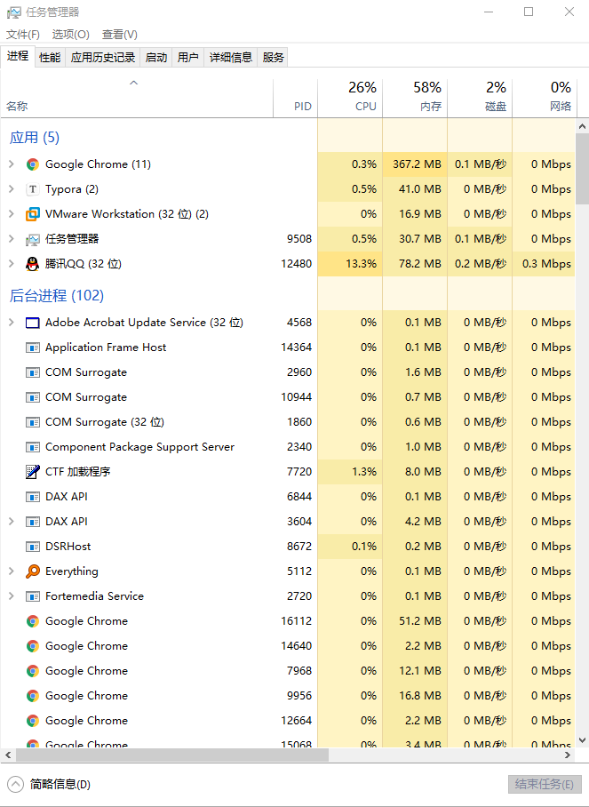
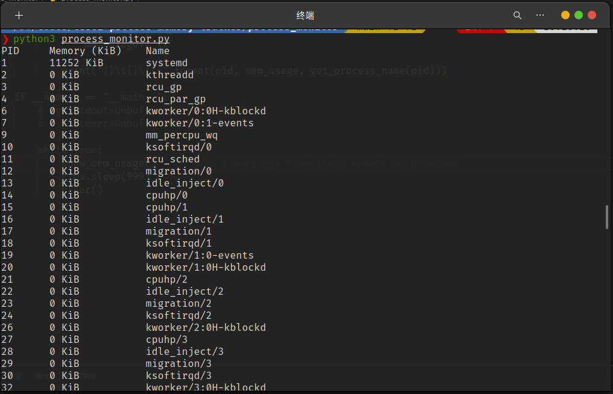
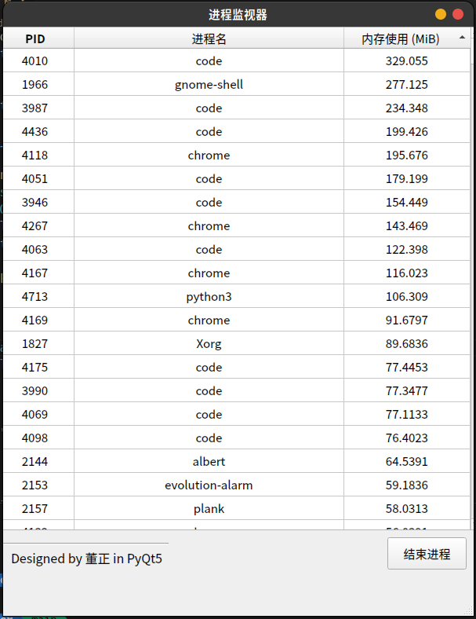

# CS302 Project 2 Design Document

Our choice is [proj19-process-memory-tracker](https://github.com/oscomp/proj19-process-memory-tracker).

## Project Background

1. What is memory?

    In computer, memory is a device or system that is used to store information for immediate use in a computer or related computer hardware and digital electronic devices. The term memory is often synonymous with the term primary storage or main memory. An archaic synonym for memory is store.

    Computer memory operates at a high speed compared to storage that is slower but offers higher capacities. If needed, contents of the computer memory can be transferred to storage; a common way of doing this is through a memory management technique called virtual memory.

2. What is memory leak and its hazard?

    In computer science, a memory leak is a type of resource leak that occurs when a computer program incorrectly manages memory allocations in a way that memory which is no longer needed is not released. A memory leak may also happen when an object is stored in memory but cannot be accessed by the running code. A memory leak has symptoms similar to a number of other problems and generally can only be diagnosed by a programmer with access to the programs' source code.

    If a program has a memory leak and its memory usage is steadily increasing, there will not usually be an immediate symptom. Every physical system has a finite amount of memory, and if the memory leak is not contained (for example, by restarting the leaking program) it will eventually cause problems.

## Project Description

The project is to show real time statistics of process memory usage and detect memory leak. This project is based on `C/C++` and `Python`, targeting on developing a tool on Linux platform, which can display the memory usage of the process you want to observe and the possible memory leakage problems in real time. The specific requirements are as follows:

- Real time statistics of the memory usage of each process and thread in the system
- Detect the allocation and release of memory and file handles of a `C/C++` program
- Detect the memory leakage in a `C/C++` program

## Design and Implementation

### Task 1

##### Requirement

Display real-time memory usage of all processes

##### Goal

Implement a tool with UI in `Python` to monitor the memory usage of processes in `Linux`.

We are all familiar to `Windows Task Manager`, and our expectation is to develop a `Linux` version: a simple software called **Process Monitor**.

##### Environment

* `Ubuntu 20.04.2 LTS x86_64` with `Linux 5.8.0-50-generic`
* `Python 3.8.5`
* `PyQt5` and `PyQt5 Tools`
* `Qt Designer`

##### References

* [Understanding memory information on Linux systems](https://linux-audit.com/understanding-memory-information-on-linux-systems/)
* [/proc/pid intro](https://github.com/NanXiao/gnu-linux-proc-pid-intro)
* [ps_mem: A python command line tool to show memory usage](https://github.com/pixelb/ps_mem)
* [Qt Doc](https://doc.qt.io/qt-5/qtgui-index.html)
* [PyQt5 Doc](https://www.riverbankcomputing.com/static/Docs/PyQt5/)
* [Qt Designer Manual](https://doc.qt.io/qt-5/qtdesigner-manual.html)

##### Design Plan & TODO List (by 5.11)

Must implement (this project required):

* [x] Learn about the files in `/proc/<pid>` folder
* [x] Implement a command line `Python` program to extract information from `/proc`
* [x] Show memory usage (RSS: resident set size) and update in real-time
* [x] Sort data by memory usage (implemented in GUI)

Further (not must-required but we will implement for the software):

* [x] Learn basic usage of `PyQt` and `Qt Designer`
* [x] Design the GUI of process monitor using `Qt Designer`
* [x] Migrate existing CLI version to GUI, and show same info
* [x] Multithreading: A new thread to fetch and update data every 1 second, then update display
* [x] Feature: sorting (ascending and descending) via clicking on the column title
* [ ] Show CPU usage of each process
* [ ] Show IO usage of each process
* [ ] Show network usage of each process
* [ ] Identify system process and user process for protection
* [ ] Show the owner of each process
* [ ] Button: kill selected process (cannot kill important system processes)
* [ ] Button & dialog: set `nice` value of selected process
* [ ] Deploy executable files & make a release of the software

If have time:

* [ ] Show these information of each process' child **threads**
* [ ] Feature: search specific process
* [ ] Beautify GUI
* [ ] Integrate Task2 & Task3 (make a GUI of task2 and task3)

##### Demo (5.11)

Command line version implemented:

GUI version:

### Task2

// TODO：王宇辰

Second, implement a tool to collect the information of memory allocation and release of a `C/C++` program.

### Task3

// TODO：王宇辰

Finally, combine all the information to detect memory leak.

References:

- [heapusage: A tool for finding memory leaks in Linux](https://github.com/d99kris/heapusage)

## Expected goals

- Develop a software: **Process Monitor**
- Develop a tool to
    - Detect memory allocation and release in a `C/C++` program
    - Detect memory leak in a `C/C++` program
- User Interface

    - Task1: GUI

    - Task2 & Task3: at least CLI

## Division of labor

| SID      | Name        | Task                   |
| :------- | :---------- | ---------------------- |
| 11813225 | WANG Yuchen | Task2 & Task3          |
| 11812804 | DONG Zheng  | Task1: Process Monitor |
| 11811305 | CUI Yusong  | Task2 & Task3          |